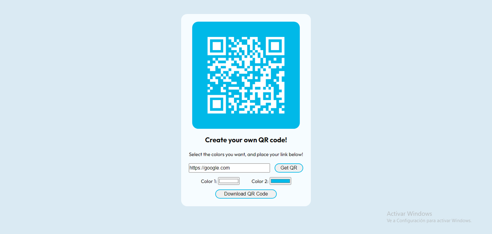
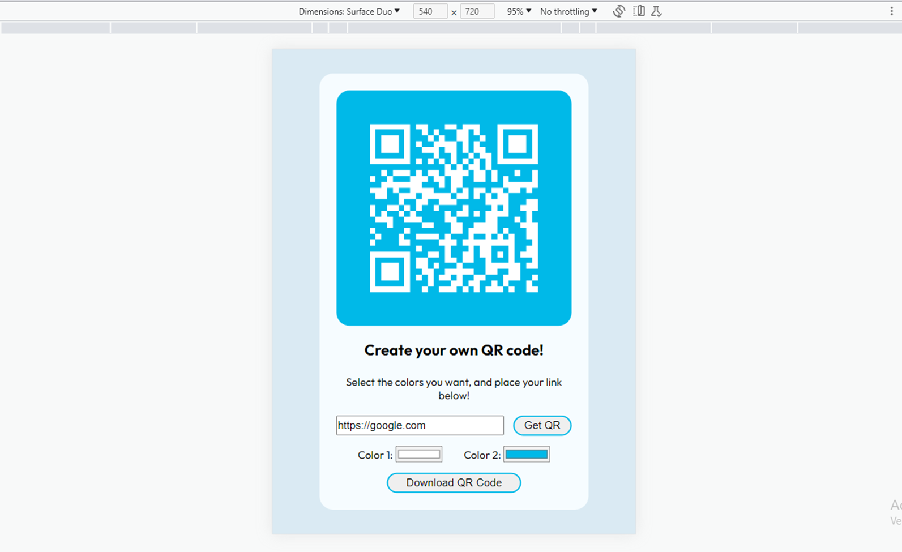

# Frontend Mentor - QR code component solution

This is a solution to the [QR code component challenge on Frontend Mentor](https://www.frontendmentor.io/challenges/qr-code-component-iux_sIO_H). Frontend Mentor challenges help you improve your coding skills by building realistic projects. 

## Table of contents

- [Overview](#overview)
  - [Screenshot](#screenshot)
  - [Links](#links)
- [My process](#my-process)
  - [Built with](#built-with)
  - [What I learned](#what-i-learned)
  - [Continued development](#continued-development)
  - [Useful resources](#useful-resources)
- [Author](#author)

## Overview

Originally a page to practice html and css. Eneded as a QR code generator with a few options for the user.

### Screenshot




### Links

- Solution URL: [QR Code Component](https://github.com/SGMaria/qr-code-component/settings)
- Live Site URL: [Github Pages](https://sgmaria.github.io/qr-code-component/)

## My process

- Basic html and javascript. 
- Built little by little, part by part. Once a part worked as intended, I moved onto the next.
- When the principal parts were done and worked as intended, I started adding styles with css.
- Moved to the options of colors and the download button.
- I focused on the Desktop view, then moved to Mobile and then Mobile Lanscape.
- Added the valitation for url erros, the text menssage and its styles.
- Finally, wrote this README and made a live page on github.

### Built with

- HTML5 markup
- CSS custom properties
- JavaScript
- QRCode.js - https://davidshimjs.github.io/qrcodejs/

### What I learned

- To use the QRCode.js to generate QR Codes.
- Validate url using:

  ``` javascript
    try {
      new URL(link);
      return true;
    } catch (err) {
      return false;
    }
    ```
- About async functions.
- About await.
- Blobs for img.

```javascript
  async function downloadImage(imageSrc, nameOfDownload = 'my-qrcode.png') {
    
    const response = await fetch(imageSrc);
    const blobImage = await response.blob();
    const href = URL.createObjectURL(blobImage);
  
    const anchorElement = document.createElement('a');
    anchorElement.href = href;
    anchorElement.download = nameOfDownload;
  
    document.body.appendChild(anchorElement);
    anchorElement.click();
  
    document.body.removeChild(anchorElement);
    window.URL.revokeObjectURL(href);
  }
```

- Using keypress for key Enter:

```javascript
  document.getElementById("qrlink").addEventListener("keypress", function(event) {
    if (event.key === "Enter") {
      event.preventDefault();
      getLink();
    }
  });
```

- Centering a div with css:

```css
div {
  position: absolute;
  top: 50%;
  left: 50%;
  transform: translate(-50%,-50%);
  }
```

- About some css propierties as: 

```css
.class {
  width: auto;
  justify-content: space-between;
  display: flex;
}

p:first-child{
    font-size: 1.4rem;
    font-weight: 700;
}
```

- The use of @media in css:

```css

@media only screen and (max-width: 460px) {}

@media only screen and (orientation: landscape) {}

```

- Using imported fonts:

```html
  <head>
    <link rel="preconnect" href="https://fonts.gstatic.com" crossorigin>
    <link href="https://fonts.googleapis.com/css2?family=Outfit:wght@100;400;500;700&family=Roboto:wght@300&display=swap" rel="stylesheet">
  </head>
```

```css
  .class{
    font-family: 'Outfit', sans-serif;
  }
```

### Continued development

- css @media
- css flex and flexbox
- css first child and childrem
- js async and promises

### Useful resources

- [Few Ways to Generate QR Code Using JavaScript](https://medium.com/geekculture/few-ways-to-generate-qr-code-using-javascript-54b6b5220c4f) - For how to generate QR codes. 
- [QRCode.js](https://davidshimjs.github.io/qrcodejs/) - For the QR code generator I needed.
- [URL Validation](https://www.freecodecamp.org/news/how-to-validate-urls-in-javascript/) - 3 ways to validate urls with javascript.
- [How to Download a File Using JavaScript](https://plainenglish.io/blog/how-to-download-a-file-using-javascript-fec4685c0a22) - Downloading files using blob.
- [CSS first:child propierty](https://developer.mozilla.org/es/docs/Web/CSS/:first-child) - CSS selector propierty.

## Author

- Frontend Mentor - [@SGMaria](https://www.frontendmentor.io/profile/SGMaria)
